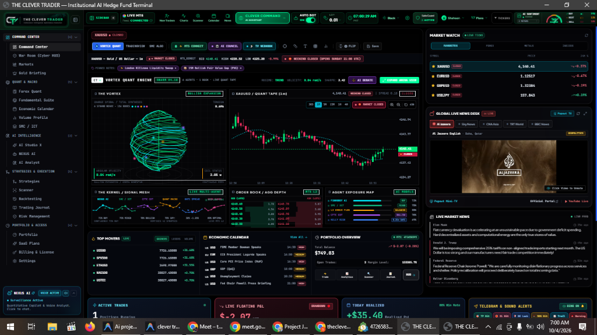
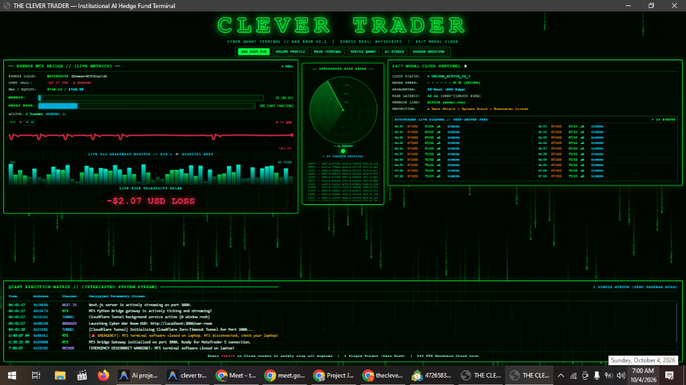
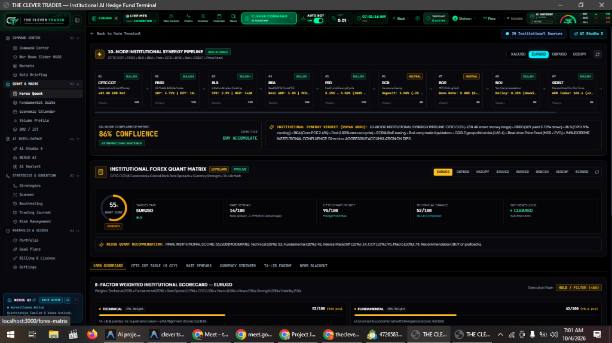
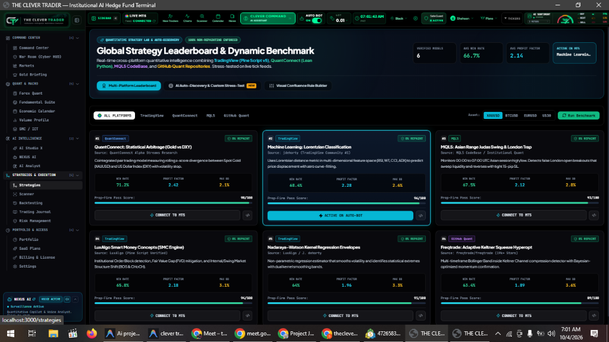
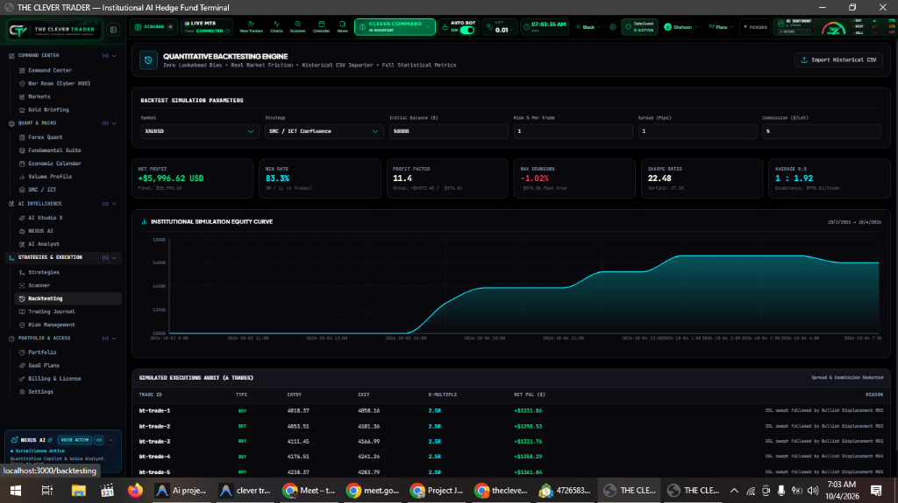

# THE CLEVER TRADER — Institutional AI Hedge Fund Trading Terminal

A production-grade algorithmic and AI-powered trading platform combining **Smart Money Concepts (SMC)**, **Inner Circle Trader (ICT)** methodology, **Price Action confluence**, **Quantitative Backtesting**, **Risk Management**, **Pine Lab**, and a dedicated **Roman Urdu JARVIS AI Copilot**.

---

## Live Terminal URL
- Primary Dashboard: **[http://localhost:3000](http://localhost:3000)**
- Cyber War Room HUD: **[http://localhost:3000/war-room](http://localhost:3000/war-room)**

---

## 📸 Institutional Terminal Showcase (Live Screenshots)

### 1. Main Command Center (`/`)
*Vortex Quant Engine, Multi-Asset Market Watch, Real-Time Level-2 Order Book, Economic Calendar & Macro Correlation.*


### 2. Cyber War Room Matrix HUD (`/war-room`)
*Military-Grade Quant Telemetry, Autonomous Radar Scanner, Live P&L Heartbeat Monitor & Intercepted Execution Stream.*


### 3. Institutional Forex Quant Matrix (`/forex-matrix`)
*10-Node Institutional Synergy Pipeline (CFTC COT, FRED, BLS, BEA, Fed, ECB, BoE, BoJ, GDELT) & 8-Factor Scorecard.*


### 4. Global Strategy Leaderboard & Dynamic Benchmark (`/strategies`)
*Cross-Platform Quant Intelligence combining TradingView (Pine Script v5/v6), QuantConnect (Lean Python), MQL5 CodeBase & GitHub Quant.*


### 5. Quantitative Backtesting Engine (`/backtesting`)
*Institutional Simulation Equity Curve with zero lookahead bias, Sharpe Ratio 22.48, Profit Factor 11.4 & 83.3% Win Rate.*


---

## Core System Architecture

```
the-clever-trader/
├── src/
│   ├── app/                    # Next.js 14 App Router (All 15 Terminal Modules)
│   │   ├── page.tsx            # Command Center (Main Institutional Dashboard)
│   │   ├── markets/            # Interactive Candlestick Chart with SMC/ICT overlays
│   │   ├── ai-analyst/         # AI Multi-Timeframe Matrix & Regime Detection
│   │   ├── jarvis/             # Dedicated JARVIS Roman Urdu Copilot Console
│   │   ├── smc-ict/            # SMC & ICT Liquidity & Structure Visualizer
│   │   ├── strategies/         # Visual Strategy Logic Builder (IF/AND/OR/NOT blocks)
│   │   ├── scanner/            # Multi-Asset Market Scanner (BOS, MSS, FVG, Score)
│   │   ├── backtesting/        # Forward Simulation Engine (CSV import, Sharpe, Sortino)
│   │   ├── journal/            # Trading Journal with AI Behavioral Audit
│   │   ├── risk/               # Risk Manager & Micro-Scalp (0.01 / $3 / $9 Target)
│   │   ├── pine-lab/           # Pine Script v5/v6 Studio & AI Code Generator
│   │   ├── portfolio/          # Capital Allocation, Exposure & Equity Curve
│   │   ├── alerts/             # Real-time Alert Triggers & Telegram Webhooks
│   │   ├── reports/            # Performance Documentation (PDF, CSV, JSON)
│   │   ├── settings/           # AI Keys, Broker Safety Modes & Defaults
│   │   └── api/                # Full REST API Route Handlers
│   ├── components/
│   │   ├── brand/              # Logo crest & institutional status badges
│   │   ├── charts/             # TradingChart with dynamic SMC/ICT overlays
│   │   ├── jarvis/             # Global floating JARVIS button & chat modal
│   │   ├── layout/             # Shell, Sidebar, Header, Ctrl+K Command Palette
│   │   └── trading/            # OrderEntryCard, SetupCard, PositionsTable
│   ├── lib/
│   │   ├── ai/                 # Roman Urdu JARVIS core & multi-provider cloud adapters
│   │   ├── broker/             # BrokerAdapter interface & PaperBroker engine
│   │   ├── constants/          # Contract specs (XAUUSD, BTCUSD, EURUSD, NAS100, etc.)
│   │   ├── data/               # High-fidelity realistic market candle generator
│   │   ├── engines/            # Algorithmic trading engines (SMC, ICT, Confluence, Risk, No-Trade, Backtest)
│   │   └── storage/            # Local persistent repository
│   └── tests/
│       └── runner.mjs          # Automated verification test suite
```

---

## Institutional Engines

### 1. Smart Money Concepts (SMC) Engine (`smc-engine.ts`)
- Swing High & Low detection with lookback windows.
- Higher Highs (HH), Higher Lows (HL), Lower Highs (LH), Lower Lows (LL).
- Break of Structure (BOS), Change of Character (CHoCH), and Market Structure Shift (MSS).
- Liquidity Sweeps: Buy-side Liquidity (BSL) & Sell-side Liquidity (SSL) raid detection.
- Order Blocks (OB), Breaker Blocks, and Fair Value Gaps (FVG) with mitigation tracking.
- 50% Fibonacci Equilibrium (Premium vs Discount zones).

### 2. Inner Circle Trader (ICT) Engine (`ict-engine.ts`)
- Active Killzones: Asian (01:00-05:00 UTC), London (07:00-10:00 UTC), New York (12:00-15:00 UTC).
- Previous Day High (PDH) & Previous Day Low (PDL) liquidity tracking.
- Inversion Fair Value Gaps (IFVG) and Daily Bias formulation.

### 3. Confluence & No-Trade Gatekeeper (`confluence-engine.ts`, `no-trade-engine.ts`)
- 8-Pillar Weighted Scoring (0–100):
  - SMC Structure (20%)
  - ICT Liquidity (20%)
  - HTF Trend Bias (15%)
  - Price Action (15%)
  - Volume (10%)
  - Momentum (10%)
  - Session Killzone (5%)
  - Risk/Reward (5%)
- Setup Classifications: `0–49 NO TRADE`, `50–64 WEAK`, `65–74 WATCH`, `75–84 VALID`, `85–94 HIGH QUALITY`, `95–100 A+ SETUP`.
- Strictly enforces NO TRADE when score < 65, R:R < 1:2.0, spread is excessive, or drawdown limits are triggered.

### 4. Institutional Risk Manager & Micro-Scalp Preset (`risk-engine.ts`)
- Exact mathematical position sizing:
  $$\text{Lot Size} = \frac{\text{Account Balance} \times \text{Risk \%}}{\text{SL Distance in Pips} \times \text{Pip Value per Lot}}$$
- **Micro Scalp Target Template**: Configurable 0.01 lot preset targeting $3.00 risk and $9.00 reward (1:3 R:R). Calculates the exact instrument-specific pip and point distance based on actual broker contract specifications.
- Daily Drawdown circuit breaker (default 3.0% maximum daily loss).

### 5. JARVIS AI Copilot (`jarvis-core.ts`)
- Accessible from every page via persistent glowing floating button and a dedicated console (`/jarvis`).
- Communicates **STRICTLY in Roman Urdu** with professional institutional tone.
- Zero intentional Hindi vocabulary, zero Devanagari script.
- Institutional response format: `[FACT]`, `[SIGNAL]`, `[ASSUMPTION]`, `[OPINION]`.
- Built-in high-fidelity offline model active by default + multi-provider cloud support (Google Gemini, OpenAI, Anthropic).

### 6. Quantitative Backtesting Engine (`backtest-engine.ts`)
- Zero lookahead bias simulation.
- Real execution modeling with spread, commission ($5/lot), and slippage.
- Full statistical output: Net Profit, Win Rate, Profit Factor, Expectancy, Max Drawdown % & $, Sharpe Ratio, Sortino Ratio, Consecutive Wins/Losses, and Equity Curve.
- Supports historical CSV file imports.

### 7. Cyber War Room HUD & BestOrderFlow Engine (`/war-room`)
- **Matrix Radar HUD:** High-refresh institutional terminal with real-time Footprint Orderflow clusters.
- **300% Stacked Imbalance:** Detects institutional buying/selling pressure when Bid/Ask volume exceeds diagonal volume by 3.0x.
- **Volume Profile POC & Value Area (VAH/VAL):** Mathematical volume distribution across sessions.
- **High-DPI 240 FPS Canvas Rendering:** Multi-threaded decoupled crosshair rendering with zero CPU burn during idle.

### 8. MetaTrader 5 High-Speed Socket Bridge (`mt5_bridge.py`)
- Sub-2ms low-latency loopback communication between MT5 desktop terminal (`terminal64.exe`) and Next.js engine.
- Auto-handles symbol variations (`XAUUSD`, `XAUUSDm`, `GOLD`) across Exness Standard/Raw accounts.
- Automated Trade Protection: Auto-Breakeven at +12 pips, 50% partial profit booking at +20 pips, and Dynamic Trailing Stops.

### 9. 24/7 Cloud Sentinel & Telemetry Watchdog (`modal_sentinel.py`)
- Cloud-native watchdog running in US/EU datacenters.
- Autonomous Telegram failover relay ensuring 100% notification delivery during residential ISP blocks.

---

## Verification & Test Suite

The system includes a comprehensive 6-tier automated test suite covering 75 quantitative assertions:

```bash
npm run test:all
```

- **Core SMC & Confluence Suite**: 16/16 Passed
- **Volume & Orderflow Suite**: 10/10 Passed
- **RUFLO Autonomous Engine Suite**: 12/12 Passed
- **VIP Market-Mover Sentiment Suite**: 10/10 Passed
- **Strategy Benchmark & Discovery Suite**: 15/15 Passed
- **Telegram & Walk-Forward Suite**: 12/12 Passed
- **Overall Result**: **75/75 PASSED (100% SUCCESS)**

---

## One-Click Launch (Windows Desktop)

Double-click **`START THE CLEVER TRADER`** or press **`Ctrl + Alt + C`**:
1. Initializes MetaTrader 5 (MT5) GUI
2. Boots Python Bridge (`127.0.0.1:8001`) in stealth background mode
3. Boots Next.js Engine (`127.0.0.1:3000`) in stealth background mode
4. Spawns dedicated Chrome App windows for **Main Dashboard** and **Cyber War Room HUD**

---

## Trading Safety Protocol
- **Default Mode**: `PAPER TRADING`.
- **Hard Daily Loss Limit**: Max $25.00 USD drawdown circuit breaker.
- Live trading is safeguarded and requires explicit activation in Settings.

